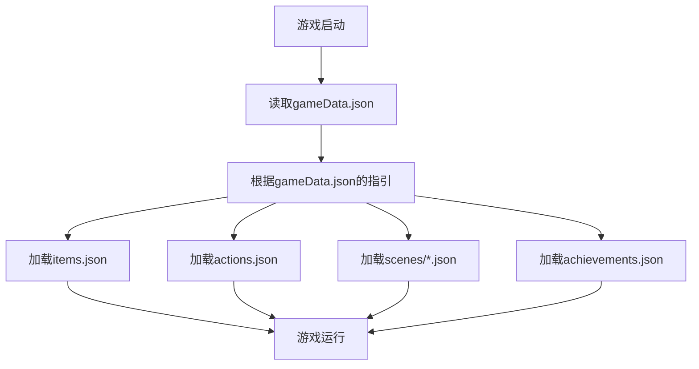

# 猫咪游戏配置系统概述

## 🎯 本文档目标读者
- 游戏策划人员
- 对编程和JSON不熟悉的设计师
- 需要修改游戏内容但不想碰代码的人员

## 📋 什么是配置系统？

想象一下，我们的游戏就像一座房子：
- **代码（TypeScript）** = 房子的框架和管道系统
- **配置文件（JSON）** = 房子里的家具和装饰品

你可以通过改变家具和装饰品来改变房子的样子，而不需要重新建造整个房子。

## 🏗️ 配置文件的作用

### 为什么使用配置文件？
1. **策划可以独立工作** - 不需要程序员帮忙
2. **快速修改** - 改一个数字就能改变游戏
3. **降低风险** - 不会因为改错而让游戏崩溃
4. **版本控制** - 可以追踪每次修改的内容

### 配置文件包含什么？
- 游戏中的物品信息
- 场景布局和对象位置
- 玩家可以做的动作
- 成就系统设置
- 游戏初始状态

## 📁 配置文件结构

```
public/assets/data/
├── gameData.json          # 游戏主配置（入口文件）
├── items.json            # 所有物品的定义
├── actions.json          # 所有动作的定义
├── achievements.json     # 成就系统配置
├── item_interactions.json # 物品交互配置
└── scenes/               # 场景配置文件夹
    ├── living_room.json  # 客厅场景
    ├── hallway.json      # 过道场景
    └── balcony.json      # 阳台场景
```

## 🔄 配置文件如何工作？



## 🎮 实际例子

### 场景配置示例
在 `scenes/living_room.json` 中：
```json
{
    "background": "placeholder_1280x720",
    "name": "客厅",
    "objects": {
        "fish_1": {
            "x": 700,
            "y": 500,
            "image": "placeholder_fish_60x30",
            "name": "小鱼干",
            "look": "一根小鱼干，闻起来好香！",
            "actions": ["pickup_fish"]
        }
    }
}
```

### 这个配置做了什么？
- 设置场景背景图片
- 在坐标(700, 500)放置一条小鱼干
- 玩家点击小鱼干可以执行"pickup_fish"动作

### 修改效果
如果你把 `"x": 700` 改成 `"x": 800`，小鱼干就会向右移动100像素。

## ⚠️ 重要提醒

### 可以安全修改的内容：
- 数字（坐标、时间、数值等）
- 文字（名称、描述、对话等）
- 图片文件名（必须是存在的图片）
- 动作列表（必须是已定义的动作）

### 不能随意修改的内容：
- JSON格式（括号、逗号、引号）
- 文件结构（不能删除必需的字段）
- 动作ID（必须与actions.json中定义的一致）

## 🚀 下一步

现在你已经了解了配置系统的基本概念，接下来可以学习：
1. [物品配置详解](./02_物品配置详解.md)
2. [场景配置详解](./03_场景配置详解.md)
3. [动作配置详解](./04_动作配置详解.md)
4. [成就配置详解](./05_成就配置详解.md)

## 💡 小贴士

- 修改配置文件后，需要重新启动游戏才能看到效果
- 建议先备份原始文件，再开始修改
- 如果游戏无法启动，检查JSON格式是否正确
- 不确定的地方可以查看其他配置文件作为参考 