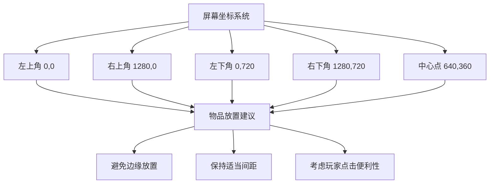

# 场景配置详解

## 🎯 什么是场景配置？

场景配置定义了游戏中的每个房间或区域，包括背景、物品位置、可交互对象等。比如客厅、过道、阳台等。

## 📁 配置文件位置

场景配置文件位于 `public/assets/data/scenes/` 文件夹中：
- `living_room.json` - 客厅场景
- `hallway.json` - 过道场景  
- `balcony.json` - 阳台场景

## 🏗️ 场景配置结构

每个场景都有以下基本结构：

```json
{
    "background": "背景图片文件名",
    "name": "场景显示名称",
    "objects": {
        "对象ID": {
            "x": 坐标X,
            "y": 坐标Y,
            "image": "图片文件名",
            "name": "对象名称",
            "look": "查看描述",
            "actions": ["动作ID列表"],
            "navTo": "导航目标场景"
        }
    }
}
```

## 📝 字段说明

### 场景级别字段

| 字段 | 类型 | 必填 | 说明 | 示例 |
|------|------|------|------|------|
| `background` | 字符串 | ✅ | 场景背景图片 | `"placeholder_1280x720"` |
| `name` | 字符串 | ✅ | 场景名称 | `"客厅"` |
| `objects` | 对象 | ✅ | 场景中的所有对象 | 见下方说明 |

### 对象级别字段

| 字段 | 类型 | 必填 | 说明 | 示例 |
|------|------|------|------|------|
| `x` | 数字 | ✅ | 对象X坐标 | `700` |
| `y` | 数字 | ✅ | 对象Y坐标 | `500` |
| `image` | 字符串 | ✅ | 对象图片 | `"placeholder_fish_60x30"` |
| `name` | 字符串 | ✅ | 对象名称 | `"小鱼干"` |
| `look` | 字符串 | ❌ | 查看时的描述 | `"一根小鱼干，闻起来好香！"` |
| `actions` | 数组 | ❌ | 可执行的动作列表 | `["pickup_fish"]` |
| `navTo` | 字符串 | ❌ | 导航到其他场景 | `"hallway"` |
| `interactive` | 布尔值 | ❌ | 是否可交互 | `true` |

## 🎮 实际例子

### 客厅场景配置
```json
{
    "background": "placeholder_1280x720",
    "name": "客厅",
    "objects": {
        "fish_1": {
            "x": 700,
            "y": 500,
            "image": "placeholder_fish_60x30",
            "name": "小鱼干",
            "look": "一根小鱼干，闻起来好香！",
            "actions": ["pickup_fish"]
        },
        "sofa": {
            "x": 500,
            "y": 250,
            "image": "placeholder_sofa_250x120",
            "name": "沙发",
            "look": "一个巨大而柔软的物体，看起来很适合磨爪子和睡觉。",
            "actions": ["scratch_sofa", "sleep_on_sofa"]
        },
        "to_hallway": {
            "x": 960,
            "y": 900,
            "image": "placeholder_arrow_down_64x64",
            "name": "过道",
            "look": "那边是过道。",
            "navTo": "hallway"
        }
    }
}
```

## 📍 坐标系统说明

### 坐标原点
- 左上角为 (0, 0)
- X轴向右增加
- Y轴向下增加

### 屏幕尺寸
- 默认屏幕尺寸：1280 x 720
- X坐标范围：0 - 1280
- Y坐标范围：0 - 720

### 坐标建议


## 🔧 常见修改

### 移动对象位置
```json
// 修改前
"fish_1": {
    "x": 700,
    "y": 500
}

// 修改后
"fish_1": {
    "x": 800,  // 向右移动100像素
    "y": 450   // 向上移动50像素
}
```

### 修改对象描述
```json
// 修改前
"look": "一根小鱼干，闻起来好香！"

// 修改后
"look": "哇！这是一根超级美味的小鱼干，闻起来就让人流口水！"
```

### 添加新动作
```json
// 修改前
"actions": ["pickup_fish"]

// 修改后
"actions": ["pickup_fish", "examine_fish", "play_with_fish"]
```

### 修改导航目标
```json
// 修改前
"navTo": "hallway"

// 修改后
"navTo": "balcony"
```

## ➕ 添加新对象

### 步骤1：准备图片
1. 将对象图片放入 `public/assets/images/` 文件夹
2. 记住图片文件名

### 步骤2：在场景中添加对象
```json
{
    "objects": {
        "新对象ID": {
            "x": 500,
            "y": 300,
            "image": "图片文件名",
            "name": "新对象名称",
            "look": "查看时的描述",
            "actions": ["相关动作ID"]
        }
    }
}
```

### 步骤3：确保动作已定义
在 `actions.json` 中确保引用的动作ID已经定义。

## 🎯 对象类型分类

### 可收集物品
```json
{
    "fish_1": {
        "x": 700,
        "y": 500,
        "image": "placeholder_fish_60x30",
        "name": "小鱼干",
        "actions": ["pickup_fish"]
    }
}
```

### 可交互家具
```json
{
    "sofa": {
        "x": 500,
        "y": 250,
        "image": "placeholder_sofa_250x120",
        "name": "沙发",
        "look": "一个巨大而柔软的物体，看起来很适合磨爪子和睡觉。",
        "actions": ["scratch_sofa", "sleep_on_sofa"]
    }
}
```

### 导航点
```json
{
    "to_hallway": {
        "x": 960,
        "y": 900,
        "image": "placeholder_arrow_down_64x64",
        "name": "过道",
        "navTo": "hallway"
    }
}
```

### 装饰性对象
```json
{
    "cat_back": {
        "x": 640,
        "y": 980,
        "image": "placeholder_80x80",
        "interactive": false
    }
}
```

## ⚠️ 注意事项

### 图片要求
- 图片必须存在于 `public/assets/images/` 文件夹中
- 文件名不包含扩展名
- 建议使用PNG格式

### 坐标注意事项
- 避免将对象放在屏幕边缘
- 保持对象之间有适当间距
- 考虑玩家点击的便利性
- 大对象（如沙发）的坐标是对象的左上角

### 动作ID要求
- 所有引用的动作ID必须在 `actions.json` 中定义
- 动作ID区分大小写
- 建议使用有意义的动作名称

### 导航要求
- `navTo` 字段的值必须是有效的场景ID
- 场景ID必须在 `gameData.json` 的 `scenes` 部分定义

## 🎨 场景设计建议

### 布局原则
1. **视觉平衡** - 对象分布要均匀
2. **功能分区** - 相关功能的对象放在一起
3. **导航清晰** - 导航点要容易找到
4. **交互便利** - 可交互对象要容易点击

### 对象放置建议
- 重要物品放在显眼位置
- 装饰性对象可以放在角落
- 导航点放在场景边缘
- 避免对象重叠

### 描述写作建议
- 使用生动有趣的语言
- 符合猫咪的视角
- 提供有用的信息
- 保持风格一致

## 🔄 与其他系统的关联

### 与物品系统的关联
场景中的对象可以引用 `items.json` 中定义的物品：
```json
{
    "fish_1": {
        "image": "placeholder_fish_60x30",  // 使用物品的图片
        "name": "小鱼干",                   // 使用物品的名称
        "actions": ["pickup_fish"]          // 使用物品的动作
    }
}
```

### 与动作系统的关联
场景对象可以执行 `actions.json` 中定义的动作：
```json
{
    "sofa": {
        "actions": ["scratch_sofa", "sleep_on_sofa"]  // 引用已定义的动作
    }
}
```

## 💡 策划建议

### 场景设计原则
1. **主题一致** - 每个场景应该有明确的主题
2. **功能完整** - 场景应该提供足够的交互选项
3. **视觉吸引** - 场景布局要美观
4. **游戏平衡** - 考虑游戏平衡性

### 对象设计建议
1. **功能明确** - 每个对象应该有明确的用途
2. **描述生动** - 用有趣的语言描述对象
3. **交互丰富** - 提供多种交互方式
4. **符合逻辑** - 对象放置要符合现实逻辑

## 🚀 下一步

学习完场景配置后，可以继续学习：
1. [动作配置详解](./04_动作配置详解.md) - 学习如何定义对象的交互动作
2. [成就配置详解](./05_成就配置详解.md) - 学习如何将场景与成就系统关联
3. [游戏数据配置](./06_游戏数据配置.md) - 学习如何配置游戏的整体数据 