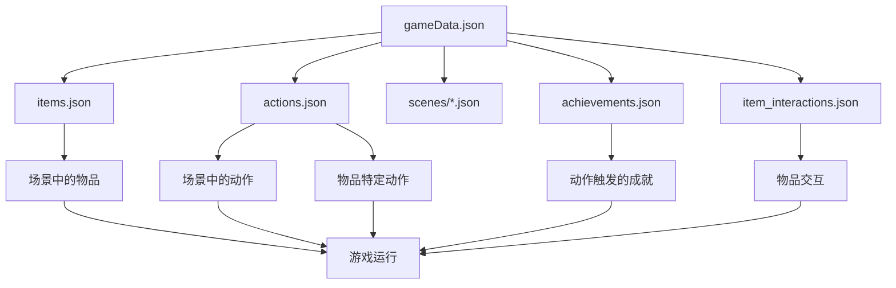

# 高级配置技巧

## 🎯 本文档目标

学习一些高级的配置技巧，让你的游戏配置更加灵活、高效和有趣。

## 🔗 配置文件的关联关系

### 配置文件依赖图



### 引用关系说明
- `gameData.json` 是主配置文件，引用其他所有配置文件
- 场景配置引用物品和动作
- 动作配置可以触发成就
- 物品配置被场景和动作使用

## 🎨 高级场景设计技巧

### 1. 动态场景布局

通过修改坐标来创建动态的视觉效果：

```json
{
    "objects": {
        "fish_1": { "x": 700, "y": 500 },
        "fish_2": { "x": 750, "y": 480 },
        "fish_3": { "x": 800, "y": 520 },
        "fish_4": { "x": 850, "y": 490 },
        "fish_5": { "x": 900, "y": 510 }
    }
}
```

**技巧**：使用不同的坐标创建自然的分布效果。

### 2. 场景层次设计

通过坐标设计场景的层次感：

```json
{
    "objects": {
        "background_decor": { "x": 0, "y": 0, "interactive": false },
        "furniture": { "x": 200, "y": 100 },
        "items": { "x": 400, "y": 200 },
        "cat": { "x": 600, "y": 300 }
    }
}
```

**技巧**：Y坐标越大，对象越靠前，玩家越容易点击。

### 3. 条件性对象显示

通过标志系统控制对象的显示：

```json
{
    "objects": {
        "hidden_treasure": {
            "x": 500,
            "y": 300,
            "image": "treasure_chest",
            "name": "宝箱",
            "look": "一个神秘的宝箱！",
            "actions": ["open_treasure"],
            "visible_when": "treasure_unlocked"
        }
    }
}
```

## 🎮 高级动作设计技巧

### 1. 连锁动作系统

设计一系列相关联的动作：

```json
{
    "actions": {
        "find_key": {
            "id": "find_key",
            "text": "找到钥匙",
            "log": "我在沙发下面找到了一把钥匙！",
            "effects": {
                "inventory": {
                    "action": "add",
                    "item": "key_item"
                },
                "special": {
                    "unlockArea": "secret_room"
                }
            }
        },
        "unlock_secret_room": {
            "id": "unlock_secret_room",
            "text": "打开密室",
            "log": "我用钥匙打开了密室的门！",
            "effects": {
                "inventory": {
                    "action": "remove",
                    "item": "key_item"
                },
                "special": {
                    "changeSceneState": {
                        "secret_door_open": true
                    }
                }
            }
        }
    }
}
```

### 2. 条件性动作

根据游戏状态显示不同的动作：

```json
{
    "actions": {
        "sleep_sofa": {
            "id": "sleep_sofa",
            "text": "在沙发上睡觉",
            "log": "我在柔软的沙发上睡着了...",
            "category": "complex",
            "timeCost": 60,
            "effects": {
                "progress": {
                    "energy": 3,
                    "humanComingHome": 10
                }
            },
            "requirements": {
                "energy": 2,
                "hungry": 1
            }
        }
    }
}
```

### 3. 多重效果动作

一个动作产生多种效果：

```json
{
    "actions": {
        "play_with_toy": {
            "id": "play_with_toy",
            "text": "玩玩具",
            "log": "我玩得很开心！",
            "category": "simple",
            "timeCost": 30,
            "effects": {
                "progress": {
                    "happiness": 15,
                    "energy": -1,
                    "humanComingHome": 3
                },
                "special": {
                    "triggerEvent": "toy_play_event"
                }
            },
            "triggerAchievement": "play_master"
        }
    }
}
```

## 🏆 高级成就设计技巧

### 1. 渐进式成就系统

设计一系列递进的成就：

```json
{
    "achievements": {
        "toy_collector_1": {
            "id": "toy_collector_1",
            "name": "玩具收集者 I",
            "description": "收集3个玩具",
            "category": "play",
            "isMainAchievement": false,
            "condition": {
                "type": "counter",
                "counter": "toyCollectionCount",
                "value": 3
            }
        },
        "toy_collector_2": {
            "id": "toy_collector_2",
            "name": "玩具收集者 II",
            "description": "收集5个玩具",
            "category": "play",
            "isMainAchievement": false,
            "condition": {
                "type": "counter",
                "counter": "toyCollectionCount",
                "value": 5
            }
        },
        "toy_master": {
            "id": "toy_master",
            "name": "玩具大师",
            "description": "收集所有玩具",
            "category": "play",
            "isMainAchievement": true,
            "condition": {
                "type": "play_completion",
                "requiredToys": ["squeaky_mouse", "spinning_ball", "cat_rope", "black_sock"],
                "timeLimit": 720
            }
        }
    }
}
```

### 2. 隐藏成就

设计一些不明显的成就：

```json
{
    "achievements": {
        "secret_explorer": {
            "id": "secret_explorer",
            "name": "秘密探索者",
            "description": "发现隐藏区域",
            "category": "explorer",
            "isMainAchievement": false,
            "condition": {
                "type": "counter",
                "counter": "secretAreaVisited",
                "value": 1
            },
            "hidden": true
        }
    }
}
```

### 3. 时间挑战成就

基于时间限制的成就：

```json
{
    "achievements": {
        "speed_runner": {
            "id": "speed_runner",
            "name": "速度跑者",
            "description": "在30分钟内完成主要目标",
            "category": "explorer",
            "isMainAchievement": true,
            "condition": {
                "type": "time_challenge",
                "mainGoal": "escape_artist",
                "timeLimit": 30
            }
        }
    }
}
```

## 🔧 高级物品设计技巧

### 1. 组合物品系统

设计可以组合的物品：

```json
{
    "items": {
        "cardboard_box": {
            "id": "cardboard_box",
            "name": "纸箱",
            "description": "一个普通的纸箱",
            "image": "placeholder_80x80"
        },
        "string": {
            "id": "string",
            "name": "绳子",
            "description": "一根结实的绳子",
            "image": "placeholder_80x80"
        },
        "trap": {
            "id": "trap",
            "name": "陷阱",
            "description": "用纸箱和绳子制作的陷阱",
            "image": "placeholder_80x80",
            "crafted_from": ["cardboard_box", "string"]
        }
    }
}
```

### 2. 稀有物品系统

设计不同稀有度的物品：

```json
{
    "items": {
        "common_fish": {
            "id": "common_fish",
            "name": "普通小鱼干",
            "description": "普通的小鱼干",
            "image": "placeholder_fish_60x30",
            "rarity": "common"
        },
        "rare_fish": {
            "id": "rare_fish",
            "name": "稀有金鱼",
            "description": "闪闪发光的金鱼！",
            "image": "golden_fish_60x30",
            "rarity": "rare"
        },
        "legendary_fish": {
            "id": "legendary_fish",
            "name": "传说神鱼",
            "description": "传说中的神鱼，据说能实现愿望！",
            "image": "legendary_fish_60x30",
            "rarity": "legendary"
        }
    }
}
```

## 🎯 高级游戏平衡技巧

### 1. 资源平衡

设计合理的资源消耗和获取：

```json
{
    "actions": {
        "eat_food": {
            "timeCost": 30,
            "hungryRestore": 2,
            "effects": {
                "progress": {
                    "humanComingHome": 5
                }
            }
        },
        "sleep": {
            "timeCost": 60,
            "energyRestore": 3,
            "effects": {
                "progress": {
                    "humanComingHome": 8
                }
            }
        }
    }
}
```

**平衡原则**：
- 时间消耗与效果成正比
- 不同动作有不同的成本收益比
- 避免单一最优策略

### 2. 难度曲线设计

通过时间限制和条件设计难度曲线：

```json
{
    "initialState": {
        "timeRemaining": 720,  // 12小时
        "hungry": 3,
        "energy": 3
    }
}
```

**难度设计**：
- 早期：简单任务，建立信心
- 中期：复杂任务，增加挑战
- 后期：困难任务，考验技巧

### 3. 多路径设计

提供多种完成目标的方式：

```json
{
    "achievementPaths": {
        "play": {
            "name": "玩耍时光",
            "mainAchievement": "playtime_master"
        },
        "destruction": {
            "name": "猫中哈士奇",
            "mainAchievement": "destruction_king"
        },
        "obedient": {
            "name": "两脚兽的盟友",
            "mainAchievement": "human_ally"
        }
    }
}
```

## 🔄 高级系统集成技巧

### 1. 事件驱动系统

通过事件触发复杂的游戏机制：

```json
{
    "actions": {
        "trigger_event": {
            "effects": {
                "special": {
                    "triggerEvent": "special_event",
                    "changeSceneState": {
                        "event_active": true
                    }
                }
            }
        }
    }
}
```

### 2. 状态机设计

通过标志系统实现状态机：

```json
{
    "flags": {
        "door_locked": true,
        "key_found": false,
        "door_unlocked": false,
        "treasure_room_visited": false
    }
}
```

### 3. 数据驱动设计

使用配置数据驱动游戏逻辑：

```json
{
    "gameData": {
        "difficulty_levels": {
            "easy": {
                "timeMultiplier": 1.5,
                "resourceMultiplier": 1.2
            },
            "normal": {
                "timeMultiplier": 1.0,
                "resourceMultiplier": 1.0
            },
            "hard": {
                "timeMultiplier": 0.8,
                "resourceMultiplier": 0.8
            }
        }
    }
}
```

## 💡 高级策划技巧

### 1. 叙事设计

通过配置创建叙事体验：

```json
{
    "actions": {
        "story_action": {
            "log": "我发现了主人的秘密日记...",
            "effects": {
                "special": {
                    "triggerEvent": "story_revelation"
                }
            }
        }
    }
}
```

### 2. 情感设计

通过数值变化影响玩家情感：

```json
{
    "progress": {
        "happiness": 10,      // 快乐值
        "curiosity": 15,      // 好奇心
        "anxiety": -5         // 焦虑值
    }
}
```

### 3. 社交设计

设计与其他角色的互动：

```json
{
    "actions": {
        "greet_neighbor_cat": {
            "text": "和邻居猫打招呼",
            "log": "邻居猫友好地回应了我！",
            "effects": {
                "progress": {
                    "social": 10,
                    "happiness": 5
                }
            }
        }
    }
}
```

## ⚠️ 高级注意事项

### 1. 性能优化
- 避免过多的嵌套结构
- 合理使用数组和对象
- 考虑配置文件的加载时间

### 2. 可维护性
- 使用一致的命名规范
- 添加详细的注释
- 模块化配置设计

### 3. 扩展性
- 预留扩展字段
- 使用版本控制
- 设计向后兼容

## 🚀 下一步

掌握这些高级技巧后，你可以：
1. 创建更复杂的游戏机制
2. 设计更有趣的玩家体验
3. 实现更灵活的游戏系统
4. 优化游戏的平衡性

继续学习：
- [配置最佳实践](./08_配置最佳实践.md)
- [故障排除指南](./09_故障排除指南.md) 