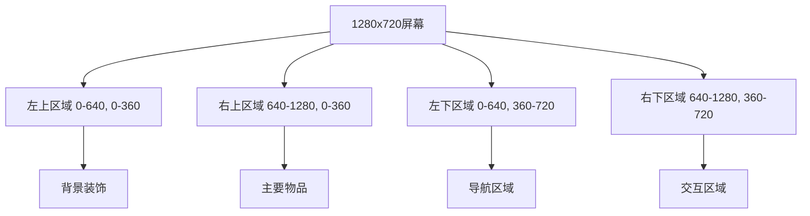
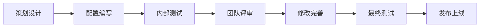

# 配置最佳实践

## 🎯 本文档目标

学习配置的最佳实践，让你的配置文件更加规范、易维护和高效。

## 📋 命名规范

### 文件命名规范

| 文件类型 | 命名规范 | 示例 |
|----------|----------|------|
| 场景文件 | 小写字母 + 下划线 | `living_room.json`, `kitchen.json` |
| 物品ID | 小写字母 + 下划线 | `fish_item`, `golden_key` |
| 动作ID | 小写字母 + 下划线 | `pickup_fish`, `sleep_on_sofa` |
| 成就ID | 小写字母 + 下划线 | `playtime_master`, `destruction_king` |

### 命名原则

```json
// ✅ 好的命名
{
    "fish_item": { "name": "小鱼干" },
    "pickup_fish": { "text": "叼走鱼" },
    "playtime_master": { "name": "玩耍时光" }
}

// ❌ 不好的命名
{
    "FishItem": { "name": "小鱼干" },        // 大写开头
    "pickupFish": { "text": "叼走鱼" },      // 驼峰命名
    "playtime-master": { "name": "玩耍时光" } // 使用连字符
}
```

### 中文命名规范

```json
// ✅ 好的中文命名
{
    "name": "小鱼干",
    "description": "美味的小鱼干，可以吃或藏起来",
    "look": "一根小鱼干，闻起来好香！"
}

// ❌ 不好的中文命名
{
    "name": "小鱼干!!!",                    // 过多标点
    "description": "小鱼干",                // 过于简单
    "look": "小鱼干"                        // 缺乏描述性
}
```

## 📁 文件组织规范

### 目录结构建议

```
public/assets/data/
├── gameData.json              # 主配置文件
├── items.json                 # 物品配置
├── actions.json               # 动作配置
├── achievements.json          # 成就配置
├── item_interactions.json     # 物品交互配置
├── scenes/                    # 场景文件夹
│   ├── living_room.json       # 客厅
│   ├── hallway.json           # 过道
│   ├── balcony.json           # 阳台
│   └── kitchen.json           # 厨房
└── templates/                 # 模板文件夹（可选）
    ├── item_template.json     # 物品模板
    └── scene_template.json    # 场景模板
```

### 文件大小控制

| 文件类型 | 建议大小 | 说明 |
|----------|----------|------|
| 单个场景文件 | < 50KB | 避免过于复杂的场景 |
| 物品配置文件 | < 100KB | 控制物品数量 |
| 动作配置文件 | < 200KB | 避免过多重复动作 |
| 成就配置文件 | < 50KB | 保持成就数量合理 |

## 🔧 配置结构规范

### JSON格式规范

```json
{
    "物品ID": {
        "id": "物品ID",
        "name": "物品名称",
        "description": "物品描述",
        "image": "图片文件名"
    }
}
```

### 字段顺序规范

建议按照以下顺序排列字段：

1. **基础字段** - id, name, description
2. **显示字段** - image, text, log
3. **功能字段** - actions, effects, condition
4. **扩展字段** - category, tags, metadata

```json
{
    "fish_item": {
        // 1. 基础字段
        "id": "fish_item",
        "name": "小鱼干",
        "description": "美味的小鱼干，可以吃或藏起来",
        
        // 2. 显示字段
        "image": "placeholder_fish_60x30",
        
        // 3. 功能字段
        "actions": ["pickup_fish", "eat_fish"],
        
        // 4. 扩展字段
        "category": "food",
        "rarity": "common"
    }
}
```

### 注释规范

在JSON中添加注释（使用特殊字段）：

```json
{
    "_comment": "小鱼干物品配置",
    "fish_item": {
        "id": "fish_item",
        "name": "小鱼干",
        "_note": "这是最基础的食物物品",
        "description": "美味的小鱼干，可以吃或藏起来"
    }
}
```

## 🎮 游戏设计规范

### 数值平衡规范

#### 时间消耗规范

| 动作类型 | 时间消耗 | 说明 |
|----------|----------|------|
| 即时动作 | 0分钟 | 捡起物品、查看物品 |
| 简单动作 | 30分钟 | 吃食物、简单玩耍 |
| 复杂动作 | 60分钟 | 深度睡眠、制作陷阱 |
| 特殊动作 | 90-120分钟 | 探索、战斗 |

```json
{
    "actions": {
        "pickup_fish": {
            "timeCost": 0,      // 即时动作
            "category": "instant"
        },
        "eat_food": {
            "timeCost": 30,     // 简单动作
            "category": "simple"
        },
        "sleep": {
            "timeCost": 60,     // 复杂动作
            "category": "complex"
        }
    }
}
```

#### 状态值规范

| 状态值 | 范围 | 说明 |
|--------|------|------|
| 饥饿值 | 0-5 | 0=非常饿，5=非常饱 |
| 精力值 | 0-5 | 0=非常疲惫，5=精力充沛 |
| 快乐值 | 0-10 | 0=不开心，10=非常开心 |

```json
{
    "effects": {
        "progress": {
            "hungry": -15,      // 减少饥饿值
            "energy": 10,       // 增加精力值
            "happiness": 5      // 增加快乐值
        }
    }
}
```

### 坐标布局规范

#### 屏幕分区



#### 坐标建议

```json
{
    "objects": {
        // 背景装饰 - 左上区域
        "background_decor": { "x": 100, "y": 100 },
        
        // 主要物品 - 右上区域
        "main_item": { "x": 800, "y": 200 },
        
        // 导航区域 - 左下区域
        "nav_exit": { "x": 200, "y": 600 },
        
        // 交互区域 - 右下区域
        "interactive_object": { "x": 1000, "y": 500 }
    }
}
```

## 🔄 版本控制规范

### 配置文件版本管理

```json
{
    "_version": "1.0.0",
    "_lastModified": "2024-01-15",
    "_author": "策划团队",
    "gameData": {
        // 实际配置内容
    }
}
```

### 变更记录

```json
{
    "_changelog": [
        {
            "version": "1.0.0",
            "date": "2024-01-15",
            "changes": [
                "初始版本",
                "添加基础物品和动作"
            ]
        },
        {
            "version": "1.1.0",
            "date": "2024-01-20",
            "changes": [
                "添加新场景：厨房",
                "调整时间消耗平衡"
            ]
        }
    ]
}
```

### 备份策略

1. **自动备份** - 使用Git等版本控制工具
2. **手动备份** - 重要修改前手动备份
3. **测试备份** - 在测试环境中验证修改

## 🧪 测试规范

### 配置验证清单

在修改配置后，检查以下项目：

- [ ] JSON格式是否正确
- [ ] 所有引用的ID是否存在
- [ ] 图片文件是否存在
- [ ] 数值是否在合理范围内
- [ ] 文字内容是否合适

### 测试流程

1. **语法检查** - 验证JSON格式
2. **引用检查** - 验证所有引用关系
3. **功能测试** - 在游戏中测试功能
4. **平衡测试** - 验证游戏平衡性

### 常见测试场景

```json
{
    "test_scenarios": {
        "new_item_test": {
            "description": "测试新添加的物品",
            "steps": [
                "添加物品到items.json",
                "在场景中放置物品",
                "测试物品交互",
                "验证物品效果"
            ]
        },
        "new_action_test": {
            "description": "测试新添加的动作",
            "steps": [
                "添加动作到actions.json",
                "在场景中绑定动作",
                "测试动作执行",
                "验证动作效果"
            ]
        }
    }
}
```

## 📊 性能优化规范

### 文件大小优化

1. **移除无用字段** - 删除不需要的配置
2. **合并相似配置** - 使用模板减少重复
3. **压缩JSON** - 移除不必要的空格和换行

### 加载优化

```json
{
    "optimization": {
        "lazy_loading": true,      // 延迟加载
        "caching": true,           // 启用缓存
        "compression": true        // 启用压缩
    }
}
```

### 内存使用优化

1. **避免深层嵌套** - 减少JSON嵌套层级
2. **使用数组而非对象** - 对于大量相似数据
3. **及时清理** - 移除不再使用的配置

## 🔒 安全规范

### 数据验证

```json
{
    "validation": {
        "required_fields": ["id", "name"],
        "numeric_ranges": {
            "hungry": [0, 5],
            "energy": [0, 5],
            "timeCost": [0, 120]
        },
        "string_lengths": {
            "name": [1, 50],
            "description": [1, 200]
        }
    }
}
```

### 输入验证

1. **数值范围检查** - 确保数值在合理范围内
2. **字符串长度检查** - 避免过长的文本
3. **特殊字符检查** - 避免危险字符

### 备份安全

1. **定期备份** - 自动备份重要配置
2. **多重备份** - 使用多个备份位置
3. **版本控制** - 使用Git等工具跟踪变更

## 👥 团队协作规范

### 分工协作

| 角色 | 职责 | 权限 |
|------|------|------|
| 主策划 | 整体设计、平衡调整 | 所有配置文件 |
| 关卡策划 | 场景设计、物品放置 | scenes/*.json |
| 系统策划 | 动作设计、成就设计 | actions.json, achievements.json |
| 数值策划 | 数值平衡、参数调整 | 所有数值相关配置 |

### 协作流程



### 沟通规范

1. **变更通知** - 重要修改前通知团队
2. **文档更新** - 及时更新相关文档
3. **评审机制** - 重要配置需要团队评审
4. **反馈收集** - 收集使用反馈并改进

## 📈 持续改进

### 数据收集

```json
{
    "analytics": {
        "track_usage": true,
        "collect_feedback": true,
        "monitor_performance": true
    }
}
```

### 改进流程

1. **数据收集** - 收集使用数据和反馈
2. **问题分析** - 分析配置问题
3. **方案设计** - 设计改进方案
4. **实施改进** - 实施配置改进
5. **效果评估** - 评估改进效果

### 最佳实践更新

定期更新最佳实践：

- 收集团队反馈
- 分析成功案例
- 总结失败教训
- 更新规范文档

## 🚀 总结

遵循这些最佳实践，你将能够：

1. **提高配置质量** - 使用规范的命名和结构
2. **提升工作效率** - 减少错误和重复工作
3. **增强团队协作** - 统一的规范和流程
4. **保证游戏质量** - 完善的测试和验证
5. **持续改进** - 基于数据和反馈的优化

记住：最佳实践不是一成不变的，要根据项目需求和团队情况进行调整和优化。 