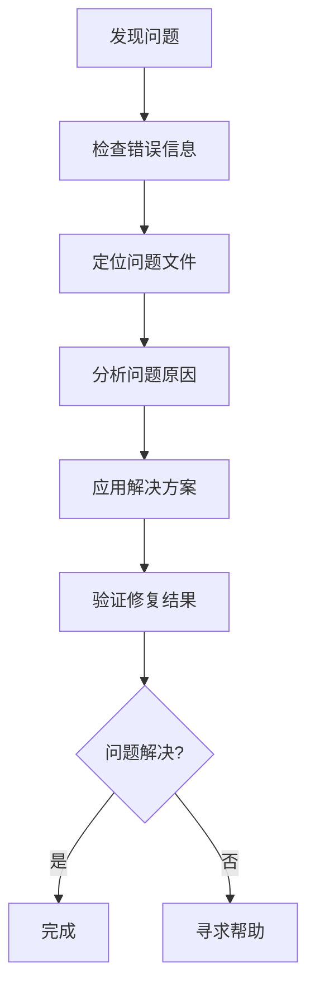
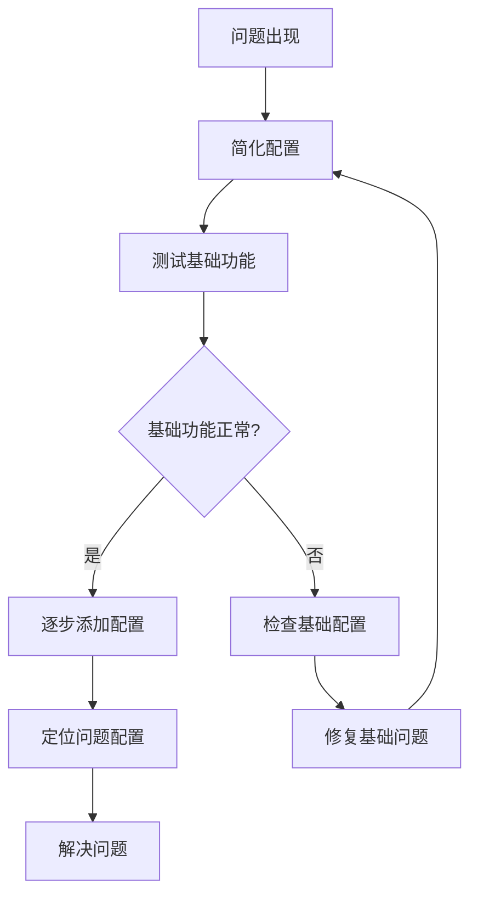

# 故障排除指南

## 🎯 本文档目标

帮助策划人员快速识别和解决配置过程中遇到的常见问题。

## 🔍 问题诊断流程

### 基本诊断步骤



### 常见错误类型

| 错误类型 | 症状 | 常见原因 |
|----------|------|----------|
| JSON格式错误 | 游戏无法启动 | 括号、逗号、引号错误 |
| 引用错误 | 物品/动作不显示 | ID不存在或拼写错误 |
| 文件路径错误 | 图片不显示 | 文件不存在或路径错误 |
| 数值错误 | 游戏行为异常 | 数值超出范围或类型错误 |

## ❌ 常见问题及解决方案

### 1. 游戏无法启动

#### 问题描述
- 游戏启动时出现错误
- 浏览器控制台显示错误信息
- 游戏界面无法加载

#### 可能原因
1. **JSON格式错误**
2. **文件路径错误**
3. **必需字段缺失**

#### 解决方案

**检查JSON格式**
```json
// ❌ 错误的JSON格式
{
    "fish_item": {
        "id": "fish_item",
        "name": "小鱼干",    // 缺少逗号
        "description": "美味的小鱼干"
    }
}

// ✅ 正确的JSON格式
{
    "fish_item": {
        "id": "fish_item",
        "name": "小鱼干",    // 添加逗号
        "description": "美味的小鱼干"
    }
}
```

**检查文件路径**
```json
// ❌ 错误的文件路径
{
    "scenes": {
        "living_room": "assets/data/scenes/living_room.json"  // 路径错误
    }
}

// ✅ 正确的文件路径
{
    "scenes": {
        "living_room": "assets/data/scenes/living_room.json"  // 确保文件存在
    }
}
```

**检查必需字段**
```json
// ❌ 缺少必需字段
{
    "fish_item": {
        "name": "小鱼干"     // 缺少id字段
    }
}

// ✅ 包含必需字段
{
    "fish_item": {
        "id": "fish_item",   // 添加id字段
        "name": "小鱼干"
    }
}
```

### 2. 物品不显示

#### 问题描述
- 场景中的物品不可见
- 物品图片显示为空白
- 物品无法交互

#### 可能原因
1. **图片文件不存在**
2. **坐标设置错误**
3. **物品ID引用错误**

#### 解决方案

**检查图片文件**
```bash
# 检查图片文件是否存在
ls public/assets/images/placeholder_fish_60x30.png
```

**检查坐标设置**
```json
// ❌ 坐标超出屏幕范围
{
    "fish_1": {
        "x": 2000,  // 超出屏幕宽度1280
        "y": 1000   // 超出屏幕高度720
    }
}

// ✅ 坐标在屏幕范围内
{
    "fish_1": {
        "x": 700,   // 在0-1280范围内
        "y": 500    // 在0-720范围内
    }
}
```

**检查物品ID引用**
```json
// ❌ 引用了不存在的物品ID
{
    "fish_1": {
        "image": "non_existent_image"  // 图片不存在
    }
}

// ✅ 引用正确的物品ID
{
    "fish_1": {
        "image": "placeholder_fish_60x30"  // 确保图片存在
    }
}
```

### 3. 动作不工作

#### 问题描述
- 点击物品没有反应
- 动作按钮不显示
- 动作执行后没有效果

#### 可能原因
1. **动作ID不存在**
2. **动作配置错误**
3. **场景绑定错误**

#### 解决方案

**检查动作ID**
```json
// ❌ 引用了不存在的动作ID
{
    "fish_1": {
        "actions": ["non_existent_action"]  // 动作不存在
    }
}

// ✅ 引用正确的动作ID
{
    "fish_1": {
        "actions": ["pickup_fish"]  // 确保动作在actions.json中定义
    }
}
```

**检查动作配置**
```json
// ❌ 动作配置不完整
{
    "pickup_fish": {
        "text": "叼走鱼"  // 缺少必需的log字段
    }
}

// ✅ 完整的动作配置
{
    "pickup_fish": {
        "id": "pickup_fish",
        "text": "叼走鱼",
        "log": "我叼起了一条鱼！"  // 添加log字段
    }
}
```

**检查场景绑定**
```json
// ❌ 场景中没有绑定动作
{
    "fish_1": {
        "x": 700,
        "y": 500,
        "image": "placeholder_fish_60x30",
        "name": "小鱼干"
        // 缺少actions字段
    }
}

// ✅ 正确绑定动作
{
    "fish_1": {
        "x": 700,
        "y": 500,
        "image": "placeholder_fish_60x30",
        "name": "小鱼干",
        "actions": ["pickup_fish"]  // 添加actions字段
    }
}
```

### 4. 成就不触发

#### 问题描述
- 完成条件后成就不解锁
- 成就进度不更新
- 成就显示错误

#### 可能原因
1. **成就条件配置错误**
2. **计数器名称错误**
3. **成就ID引用错误**

#### 解决方案

**检查成就条件**
```json
// ❌ 成就条件配置错误
{
    "toy_collector": {
        "condition": {
            "type": "counter",
            "counter": "wrong_counter_name",  // 计数器名称错误
            "value": 5
        }
    }
}

// ✅ 正确的成就条件
{
    "toy_collector": {
        "condition": {
            "type": "counter",
            "counter": "toyCollectionCount",  // 使用正确的计数器名称
            "value": 5
        }
    }
}
```

**检查成就ID引用**
```json
// ❌ 引用了不存在的成就ID
{
    "pickup_fish": {
        "triggerAchievement": "non_existent_achievement"  // 成就不存在
    }
}

// ✅ 引用正确的成就ID
{
    "pickup_fish": {
        "triggerAchievement": "fish_pickup"  // 确保成就在achievements.json中定义
    }
}
```

### 5. 数值异常

#### 问题描述
- 饥饿值/精力值异常
- 时间消耗不合理
- 游戏平衡失调

#### 可能原因
1. **数值超出范围**
2. **数值类型错误**
3. **计算逻辑错误**

#### 解决方案

**检查数值范围**
```json
// ❌ 数值超出合理范围
{
    "effects": {
        "progress": {
            "hungry": 100,  // 超出0-5范围
            "energy": -10   // 超出0-5范围
        }
    }
}

// ✅ 数值在合理范围内
{
    "effects": {
        "progress": {
            "hungry": -2,   // 在合理范围内
            "energy": 3     // 在合理范围内
        }
    }
}
```

**检查数值类型**
```json
// ❌ 数值类型错误
{
    "timeCost": "30",  // 字符串类型
    "hungry": "3"      // 字符串类型
}

// ✅ 正确的数值类型
{
    "timeCost": 30,    // 数字类型
    "hungry": 3        // 数字类型
}
```

## 🛠️ 调试工具和技巧

### 1. 浏览器开发者工具

**打开开发者工具**
- Windows/Linux: `F12` 或 `Ctrl+Shift+I`
- Mac: `Cmd+Option+I`

**查看控制台错误**
```javascript
// 在控制台中查看错误信息
console.error("配置错误信息");
```

**检查网络请求**
- 查看Network标签页
- 检查JSON文件是否正确加载
- 查看HTTP状态码

### 2. JSON验证工具

**在线JSON验证器**
- [JSONLint](https://jsonlint.com/)
- [JSON Editor Online](https://jsoneditoronline.org/)

**VS Code扩展**
- JSON Tools
- JSON Formatter

### 3. 配置检查清单

在修改配置后，使用以下清单进行检查：

- [ ] JSON语法是否正确？
- [ ] 所有引用的ID是否存在？
- [ ] 文件路径是否正确？
- [ ] 数值是否在合理范围内？
- [ ] 必需字段是否完整？
- [ ] 图片文件是否存在？

## 🔧 高级调试技巧

### 1. 逐步排查法



### 2. 对比法

**创建测试配置**
```json
{
    "test_item": {
        "id": "test_item",
        "name": "测试物品",
        "description": "用于测试的物品",
        "image": "placeholder_80x80"
    }
}
```

**与工作配置对比**
- 逐字段对比
- 找出差异
- 应用正确的配置

### 3. 日志调试法

**添加调试信息**
```json
{
    "_debug": {
        "version": "1.0.0",
        "lastModified": "2024-01-15",
        "author": "策划人员",
        "notes": "调试信息"
    },
    "actual_config": {
        // 实际配置内容
    }
}
```

## 📞 获取帮助

### 1. 自助解决

1. **查看本文档** - 寻找相似问题
2. **检查现有配置** - 参考工作配置
3. **使用调试工具** - 分析错误信息
4. **简化问题** - 逐步排查

### 2. 团队协作

**准备信息**
- 错误信息截图
- 相关配置文件
- 问题重现步骤
- 已尝试的解决方案

**联系开发团队**
- 提供详细的问题描述
- 附上相关配置文件
- 说明问题的影响范围

### 3. 常见问题库

**建立问题库**
```json
{
    "common_issues": {
        "json_syntax_error": {
            "description": "JSON语法错误",
            "symptoms": ["游戏无法启动", "控制台显示语法错误"],
            "solutions": ["检查括号匹配", "验证JSON格式"]
        },
        "missing_reference": {
            "description": "引用错误",
            "symptoms": ["物品不显示", "动作不工作"],
            "solutions": ["检查ID是否存在", "验证文件路径"]
        }
    }
}
```

## 🚀 预防措施

### 1. 备份策略

**自动备份**
- 使用Git等版本控制工具
- 定期备份重要配置
- 保留多个版本

**手动备份**
```bash
# 备份配置文件
cp public/assets/data/gameData.json public/assets/data/gameData.json.backup
cp public/assets/data/items.json public/assets/data/items.json.backup
```

### 2. 测试流程

**修改前测试**
1. 备份当前配置
2. 在测试环境中验证
3. 确认修改效果

**修改后验证**
1. 检查基本功能
2. 测试相关功能
3. 验证游戏平衡

### 3. 文档记录

**记录修改**
```json
{
    "_changelog": [
        {
            "date": "2024-01-15",
            "change": "添加新物品：金鱼",
            "files": ["items.json", "scenes/living_room.json"],
            "tested": true
        }
    ]
}
```

## 🎯 总结

通过掌握这些故障排除技巧，你将能够：

1. **快速定位问题** - 使用系统化的诊断流程
2. **有效解决问题** - 应用针对性的解决方案
3. **预防问题发生** - 建立完善的预防措施
4. **提高工作效率** - 减少问题解决时间

记住：遇到问题时不要慌张，按照诊断流程逐步排查，大多数问题都能通过本文档中的方法解决。 