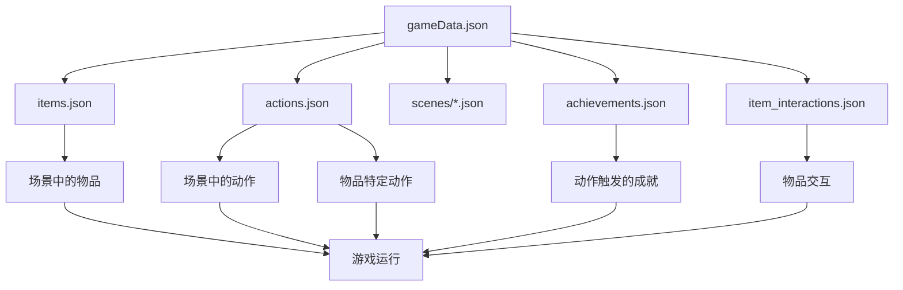

# 猫咪游戏配置文档

## 🎯 欢迎来到配置文档！

这份文档专为**游戏策划人员**和**设计师**编写，即使你不懂编程或JSON，也能轻松修改游戏内容。

## 📚 文档导航

### 🚀 入门指南
1. **[配置系统概述](./01_配置系统概述.md)** - 了解配置系统的基本概念和工作原理
   - 什么是配置文件？
   - 为什么使用配置文件？
   - 配置文件如何工作？

### 📖 基础配置
2. **[物品配置详解](./02_物品配置详解.md)** - 学习如何配置游戏中的物品
   - 物品的基本结构
   - 如何添加新物品
   - 物品分类和设计建议

3. **[场景配置详解](./03_场景配置详解.md)** - 学习如何配置游戏场景
   - 场景布局和对象放置
   - 坐标系统说明
   - 场景设计原则

4. **[动作配置详解](./04_动作配置详解.md)** - 学习如何配置游戏动作
   - 动作效果和条件
   - 时间消耗系统
   - 动作分类和平衡

5. **[成就配置详解](./05_成就配置详解.md)** - 学习如何配置成就系统
   - 成就解锁条件
   - 成就路径设计
   - 成就分类和平衡

6. **[游戏数据配置](./06_游戏数据配置.md)** - 学习如何配置游戏整体数据
   - 初始状态设置
   - 文件引用关系
   - 状态值系统

### 🔧 高级技巧
7. **[高级配置技巧](./07_高级配置技巧.md)** - 学习高级配置技巧
   - 动态场景设计
   - 连锁动作系统
   - 高级游戏平衡

8. **[配置最佳实践](./08_配置最佳实践.md)** - 学习配置的最佳实践
   - 命名规范
   - 文件组织
   - 版本控制

9. **[故障排除指南](./09_故障排除指南.md)** - 学习如何解决配置问题
   - 常见错误
   - 调试技巧
   - 问题排查

## 🎮 快速开始

### 第一步：了解基本概念
阅读 [配置系统概述](./01_配置系统概述.md)，了解配置文件的基本概念。

### 第二步：学习基础配置
按照顺序学习基础配置文档：
1. 物品配置 - 了解如何定义游戏物品
2. 场景配置 - 了解如何布置游戏场景
3. 动作配置 - 了解如何定义交互动作
4. 成就配置 - 了解如何设计成就系统
5. 游戏数据配置 - 了解如何设置游戏整体数据

### 第三步：实践和实验
- 尝试修改现有的配置文件
- 添加新的物品或场景
- 调整游戏平衡参数

### 第四步：学习高级技巧
- 学习高级配置技巧
- 掌握最佳实践
- 了解故障排除方法

## 📁 配置文件结构

```
public/assets/data/
├── gameData.json              # 游戏主配置（入口文件）
├── items.json                 # 物品定义
├── actions.json               # 动作定义
├── achievements.json          # 成就系统
├── item_interactions.json     # 物品交互
└── scenes/                    # 场景配置文件夹
    ├── living_room.json       # 客厅场景
    ├── hallway.json           # 过道场景
    └── balcony.json           # 阳台场景
```

## 🔄 配置文件关系图



## 💡 学习建议

### 对于初学者
1. **按顺序学习** - 从概述开始，按文档顺序学习
2. **动手实践** - 每学一个概念就尝试修改配置
3. **备份文件** - 修改前先备份原始文件
4. **小步前进** - 每次只修改一个地方，测试后再继续

### 对于有经验的策划
1. **重点学习** - 直接学习你需要的配置类型
2. **参考示例** - 查看现有配置作为参考
3. **实验创新** - 尝试新的配置组合
4. **优化平衡** - 关注游戏平衡性

### 对于团队协作
1. **统一规范** - 使用一致的命名和格式
2. **版本控制** - 使用Git等工具管理配置
3. **文档记录** - 记录重要的配置决策
4. **测试验证** - 修改后及时测试

## ⚠️ 重要提醒

### 安全修改
- ✅ 可以修改：数字、文字、图片文件名
- ✅ 可以添加：新的物品、动作、场景
- ✅ 可以调整：坐标、时间、数值

### 谨慎修改
- ⚠️ 文件结构：不要删除必需的字段
- ⚠️ JSON格式：保持正确的括号、逗号、引号
- ⚠️ 引用关系：确保引用的ID存在

### 避免修改
- ❌ 代码文件：不要修改.ts或.js文件
- ❌ 系统字段：不要修改系统必需的字段
- ❌ 文件路径：不要随意修改文件路径

## 🆘 需要帮助？

### 常见问题
1. **游戏无法启动** - 检查JSON格式是否正确
2. **物品不显示** - 检查图片文件是否存在
3. **动作不工作** - 检查动作ID是否正确
4. **成就不触发** - 检查成就条件是否合理

### 获取帮助
1. 查看 [故障排除指南](./09_故障排除指南.md)
2. 检查现有配置文件作为参考
3. 联系开发团队获取技术支持

## 🎯 学习目标

完成这些文档的学习后，你将能够：

1. **独立配置游戏内容** - 不需要程序员帮助
2. **快速修改游戏参数** - 调整平衡性和难度
3. **添加新的游戏元素** - 物品、场景、动作、成就
4. **设计复杂的游戏机制** - 使用高级配置技巧
5. **维护和优化游戏** - 使用最佳实践

## 🚀 开始你的配置之旅！

选择下面的文档开始学习：

- [配置系统概述](./01_配置系统概述.md) - 新手必读
- [物品配置详解](./02_物品配置详解.md) - 想添加新物品
- [场景配置详解](./03_场景配置详解.md) - 想修改场景布局
- [动作配置详解](./04_动作配置详解.md) - 想添加新动作
- [成就配置详解](./05_成就配置详解.md) - 想设计成就系统
- [游戏数据配置](./06_游戏数据配置.md) - 想调整游戏整体设置

祝你配置愉快！🐱 